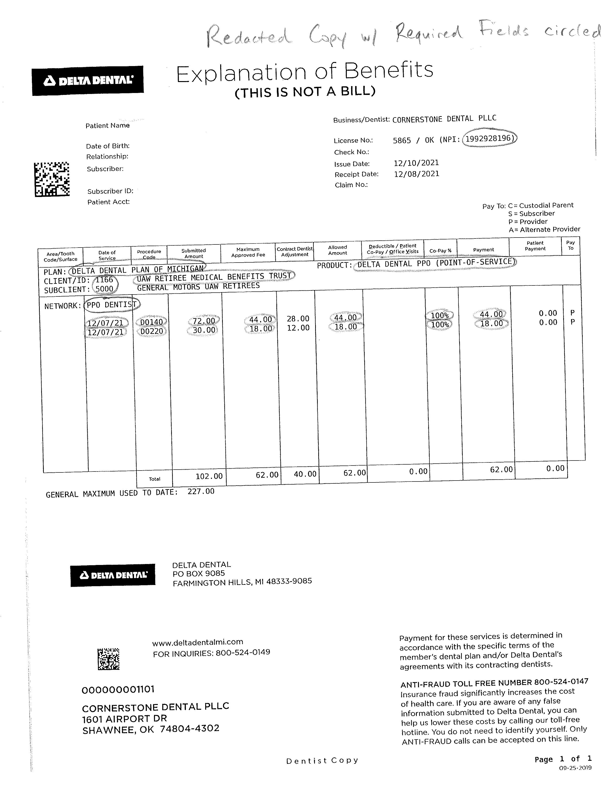
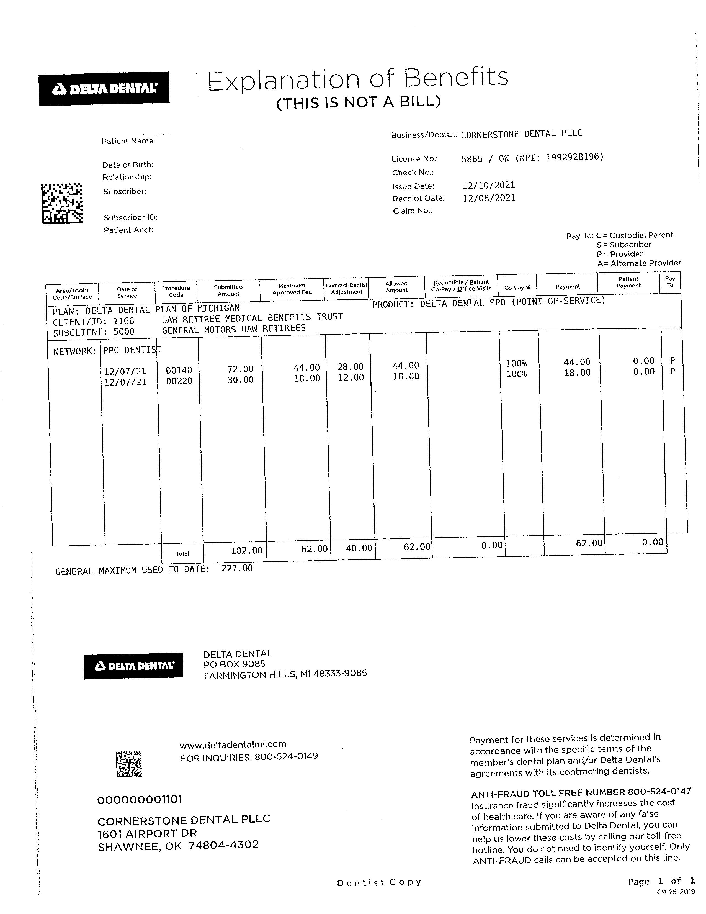
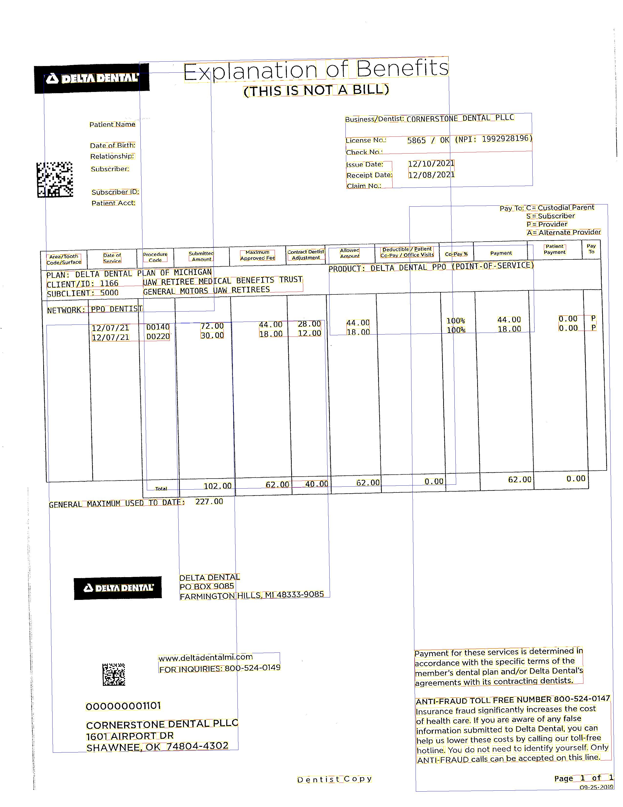
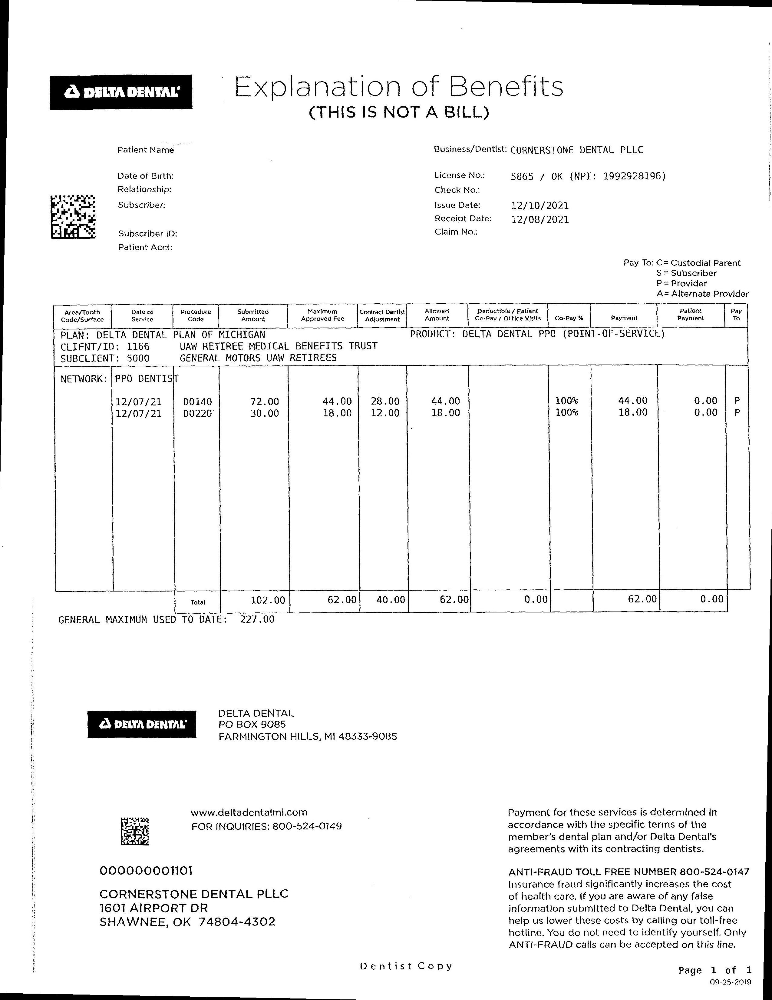
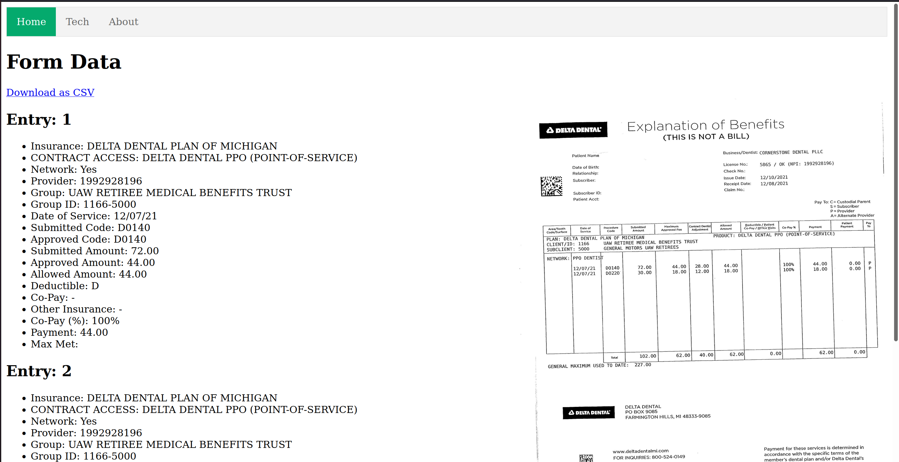

# Team 7 - OCR
Eric Chen, Kaden Cochran, Nick Thompson

---

## Problem

- Delta Dental Insurance
- Automate form data extraction
- Display required fields

---

## Solution
- Web-app interface accessible to all machines
- Google Cloud Vision API
    - Easily detect and classify multiple objects including the location of each object within an image via Google's pre-trained machine learning agents
- Python
    - Pillow - Python library used for loading, cropping, resizing and rotating images
    - Flask - Python web framework, perfect for small applications

--- 

## Pre-Processing Steps
- Skew correction
- Translation correction
- 'Divide and Conquer'
    - Section out multiple sub-images
    - Multiple API calls - use multithreading

---

### Before

---

### After

---

## Output
- Results displayed onto a webpage
- Able to download as CSV
- Preview of uploaded image

---

### Output cont.

---

## Demo

[Try me!](/upload)
[Video](https://youtu.be/RgIAEQu2wmE)

---

## Obstacles/Issues
- Cost of Vision API
    - First 1000 units free, subsequent 1000 units $1.50
    - $0.075 per document scanned
- Erroneous Output
- Communication

## Technology Used

[Here](/tech.html)